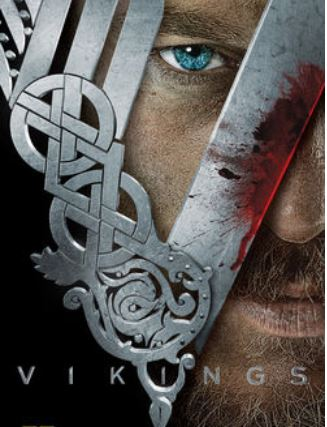

# Vikingos

## Ejercicio integrador
**El Jístori Chánel está a punto de sacar la nueva temporada de Vikings pero por una extraña razón muchos de sus productores se mimetizaron con la serie y sus personajes y decidieron vivir como dicha sociedad. Para esto nos pidieron que les demos un sistema el cual los ayude a ser mejores vikingos y lograr reconquistar París como el gran Ragnar Lothbrok.**

Para esto tenemos que empezar por modelar las expediciones, y a los vikingos que van en ellas. Los vikingos se dividen en castas sociales: están los Jarl (esclavos), luego los Karl (casta media) y por último los Thrall (nobles). A su vez, los vikingos son soldados o granjeros: pueden existir soldados y granjeros de todas las castas.

¡No cualquiera puede subir a una expedición y así alcanzar la fama! Un vikingo en general puede ir a una expedición siempre y cuando sea productivo. Para ello un soldado debe haberse cobrado más de 20 vidas y tener armas. Los granjeros también pueden ser productivos pero dependerá de la cantidad de hijos que tienen y las hectáreas designadas para poderlos alimentar (mínimo 2 hectáreas por hijo). En cualquier caso, hay que tener siempre en cuenta la casta: a un vikingo de cualquier casta social se le permite subir a una expedición pero en el caso de los Jarl (esclavos), no pueden ir si tienen armas. 

Estas expediciones a veces valen la pena y a veces no. Una expedición vale la pena cuando toda aldea y toda capital involucradas en la expedición valen la pena. 

La invasión de una capital vale la pena si en el botín conseguido hay al menos tres monedas de oro por cada vikingo en la expedición. El botín es tantas monedas de oro como defensores derrotados, potenciado o disminuído por un factor de riqueza de la tierra de la capital. Se sabe que cuando se invada la capital, cada vikingo se cobrará la vida de un defensor.

En caso de invasión de aldeas (que no están defendidas), valdrá la pena cuando el botín que se pueda obtener sacie la sed de saqueos (15 monedas de oro o más en cada aldea). Éste se calcula como la cantidad total de crucifijos que hayan en las iglesias dentro de la aldea (y que luego serán robados).  Existen además aldeas amuralladas, que son como las aldeas pero para valer la pena además hay que tener una cantidad mínima de vikingos en la comitiva.

Como sabemos, los vikingos tienen una gran organización social que les permite ascender en la escala social. Los Jarl (esclavos) pueden convertirse en Karl (casta media) y en ese momento ganan 10 armas en el caso de ser soldados, y 2 hijos y 2 hectáreas en caso de ser granjeros. Los Karl se convierten en Thrall (nobles), pero los Thrall no escalan más.

### Se pide:
Código, punto de entrada y diagrama de clases de la solución para todos los puntos siguientes:

### 1. Armar expediciones

1. Subir un vikingo a una expedición. Si no puede subir no debe hacerlo, y se debe avisar correspondientemente.
2. Hacer un test para probar lo que sucede al intentar subir si no se pudo, con la construcción de los objetos necesarios.

### 2. Expediciones que valen la pena
1. Saber si una expedición vale o no la pena.
2. Hacer un test para probar esto, con la construcción de los objetos necesarios.

### 3. Realizar una expedición. 
Esto implica invadir todos los objetivos involucrados (produciendo los efectos correspondientes) pero también dividiendo equitativamente el botín en oro de la expedición entre los vikingos que la integraron. 

### 4. Pregunta teórica: 
Aparecen los castillos, que son un nuevo posible objetivo a invadir además de las aldeas y capitales. ¿Pueden agregarse sin modificar código existente? Explicar cómo agregarlo. Justificar conceptualmente.

### 5. Ascenso social
1. Hacer que un vikingo escale socialmente.
2. Hacer un test en el que se pruebe que funcione correctamente que el vikingo Ragnar, que pertenece a los Karl, escale. Realizar las construcciones necesarias.
